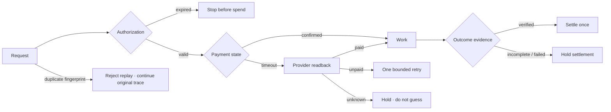

# Agent Cash Cow OS

What should an AI agent do when a payment times out?

The payment may already have gone through. Paying again could mean paying twice.

I'm exploring how to handle that safely: check the payment, keep track of the original payment, and stop when the answer is still unclear.

[**Try the Transaction Lab**](https://www.sarmadtawfeek.com/agent-cash-cow)

Start with “Timeout after payment,” then change the inputs and see what happens.

The lab uses made-up transactions. **No real money**, account or credentials are needed. It's a public demo; I keep the full system private.

## Want to discuss a similar workflow?

Email me at <sarmadtawfeek@gmail.com> with a few sentences about the failure you're trying to avoid. We can start with a reliability review or one focused fix. We'll agree on scope and price before starting. Please leave out sensitive data.

[Portfolio](https://www.sarmadtawfeek.com) · [GitHub profile](https://github.com/SamCT86)

<details>
<summary>Code, tests and technical details</summary>

## The 15-second failure

| Step | What happens | Naive system | Guarded system |
|---|---|---|---|
| 1 | An agent submits a payment | — | — |
| 2 | The acknowledgement times out | “Payment failed.” | “State is ambiguous.” |
| 3 | The provider says **paid** | Ignore it / retry | Read it before acting |
| 4 | Another payment is considered | **Pay again** | **Block the duplicate** |

That is the core idea this repository makes inspectable.

This repository contains a **synthetic public demonstrator**, not the private production implementation. It uses no real money, provider credentials, customer data, private runtime source, or production payment adapters.

## Verify the idea in 60 seconds

1. Run **Timeout after payment** — the provider says paid, so a second payment is not allowed.
2. Run **Duplicate replay** — the synthetic replay resolves to the same original trace identity.
3. Run **Unknown provider state** — the system holds instead of guessing.
4. Open the proof receipt and verify its deterministic hash.

Then break the inputs yourself.

## Break it yourself

The Transaction Lab lets you change:

- authorization: valid / expired;
- payment acknowledgement: confirmed / timeout;
- provider readback: paid / unpaid / unknown;
- duplicate replay: yes / no;
- outcome evidence: verified / incomplete / failed.

Each run returns:

- a decision;
- the next safe action;
- a six-stage trace;
- an event ledger;
- reasons and risks prevented;
- a deterministic proof receipt.

### Example

```text
PAYMENT ACK       timeout
PROVIDER READBACK paid

NAIVE             retry payment
GUARDED           do not retry

PAYMENT ACTION    DO NOT RETRY
FINAL DECISION    SETTLE ONCE
ECONOMIC ACTIONS  1
```

## Public architecture



The diagram is a **public abstraction**. It intentionally does not disclose private orchestration, persistence, recovery, provider adapters, authorization policy, model routing, forecast systems, or product-specific economic logic.

## What is actually verifiable here?

| Evidence class | Meaning |
|---|---|
| **VERIFIED HERE** | Deterministic simulator behavior, traces, receipt hashes, failure scenarios, public CI. |
| **ILLUSTRATIVE** | Synthetic transaction/business scenarios. |
| **PRIVATE / NOT DISTRIBUTED** | Production implementation and proprietary runtime mechanisms. |
| **NOT YET PROVEN** | Market demand, production-scale economics, forecast advantage, generalized production readiness. |

The useful part is not “trust our architecture slide.”  
The useful part is: **run a failure, inspect why the decision changed, verify the receipt, and run the tests yourself.**

## Verify it from GitHub

No dependencies or secrets are required.

```bash
node --test tests/*.test.mjs
node scripts/verify-public-proof.mjs
```

The verifier checks deterministic scenarios, receipt integrity, security/IP boundaries, claim language and zero-network demo constraints.

## Why a proof repo instead of the product source?

Because public proof and proprietary implementation have different jobs.

This repository is deliberately safe to inspect and fork for evaluation. The private core remains private by architecture, not by minification or obscurity.

**Public:** behavioral model, trace semantics, synthetic failure handling, proof receipts, tests.  
**Private:** runtime/orchestration, provider adapters, credentials, persistence/recovery, exact policies, private evaluation/forecast systems and real-money execution paths.

See [Claims & boundaries](docs/claims-and-boundaries.md) and [Threat model](docs/threat-model.md).

## Technical diligence

- [Architecture](docs/architecture.md)
- [Proof model](docs/proof-model.md)
- [Threat model](docs/threat-model.md)
- [Claims & boundaries](docs/claims-and-boundaries.md)
- [Partner diligence](docs/partner-diligence.md)
- [Security policy](SECURITY.md)
- [Forecast Evidence reference](https://github.com/SamCT86/agent-forecast-foundry-case-study) — separate bounded proof of evidence/runtime discipline for autonomous-agent runs.

## Commercial entry point

If this proof maps to a real autonomous-agent or integration workflow, the closest current engagement is a **Reliability review**: failure, duplicate-action and handoff testing plus a prioritized action list.

If the specific failure is already understood, a **Fix sprint** is the bounded implementation path: one change against a pre-agreed metric, followed by outcome verification.

Start with **2–3 sentences** describing the workflow and the failure you do not trust it to survive. No technical brief, meeting, credentials or sensitive data are required to start. Scope and price are agreed before anything is ordered.

Email: `sarmadtawfeek@gmail.com` · [See the current engagement options](https://www.sarmadtawfeek.com)

This is a commercial next-step path, **not** evidence of paid adoption, ROI or production-scale economics for Agent Cash Cow OS.

## For potential partners

If your interest is transaction reliability, agent commerce, payment-state reconciliation, exact-once economic actions, or outcome-gated settlement, start with the [partner diligence note](docs/partner-diligence.md).

Then break the lab.

The strongest next conversation is not “what features do you have?” It is:

> **Which economic failure do you need an autonomous system to survive without guessing?**

---

**Public proof surface · synthetic data only · no real money**

Portfolio: [sarmadtawfeek.com/agent-cash-cow](https://sarmadtawfeek.com/agent-cash-cow)

</details>
