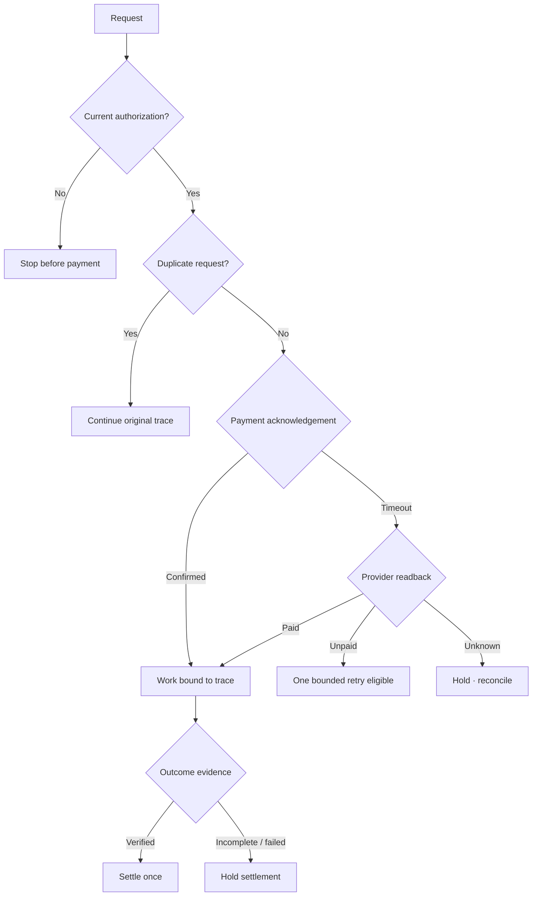

# Public architecture

This document describes the **public demonstrator architecture**, not the private production system.

## Six-stage control model

## Design properties demonstrated publicly

### One trace identity

Every synthetic run derives a deterministic trace identity from normalized inputs.

### Read before retry

A timeout is treated as ambiguity, not proof of failure.

### Replay containment

A duplicate request represents an existing trace and does not create a second synthetic payment/work/settlement.

### Outcome-gated settlement

The work stage finishing is not sufficient evidence of an accepted result.

## What is intentionally absent

The public model does not expose private orchestration, storage schema, provider adapters, production retry/backoff rules, authorization implementation, forecasting/evaluation internals, model routing or real-money settlement.
